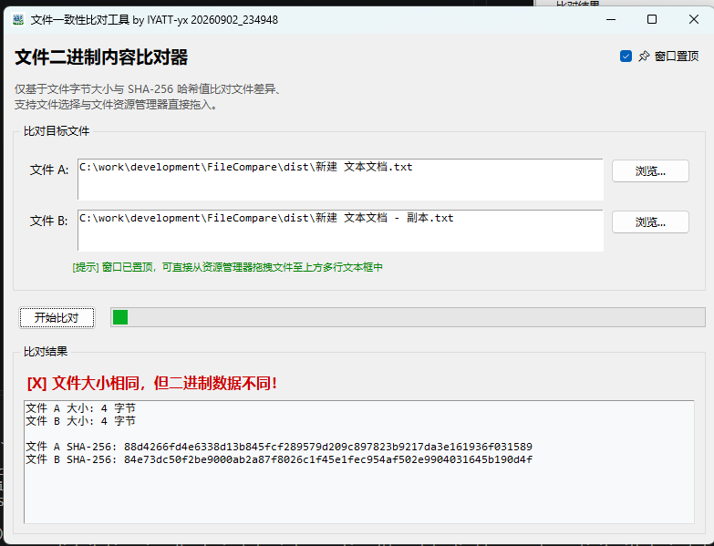

# FileCompare

2026/9/2  
本工具用于比对 2 个文件内容是否相同，首先比对文件大小，文件大小相同再比对 SHA-256 作为最终判定。  
  

至于为什么写这个文件比对工具，则是被某家汽车底盘公司搞出来的，还是家国有独资企业。只是他们研发变更太随意了，我上班的公司在给他们生产电机、减速器、差速器合一的机壳，项目是我在负责。他们经常变更不标记出来，还要我自己去比对差异。我们接了 3 款类似结构的机壳，有 2 款是去年接的，这两款在一年多的时间里各自都有十几次变更了。并且他们审图也是相当于没有吧，多次出现图纸与三维模型不符合、错误标注、漏标注，提出来后他们又改。比如最近 3 款机壳都变更发了图纸，我审图发现其中有一款明显不对劲，反馈情况后对方说是导错图纸了，然后又重新导出新图纸下发。等他们采购传递过来的时候把另外两款的机壳图纸又传了一遍，我已知其中一款是重新导出的，但是另外两款到底有没有改就不知道了。因此就需要比对文件差异，比对图纸内容的话，每款机壳几百个尺寸太费时了，系统有命令工具也可以比对，但是不是那么方便，想着以后少不了还要比对图纸，干脆单独写个小工具来比对。好在比对出来这两款确实没有修改，就不需要我去审图纸和模型的变更内容了。  

# 测试环境

Python 3.14.5  
支持 Windows 10 及以上系统  

# 许可协议

本项目基于 [MIT](./LICENSE) 许可协议开源。  